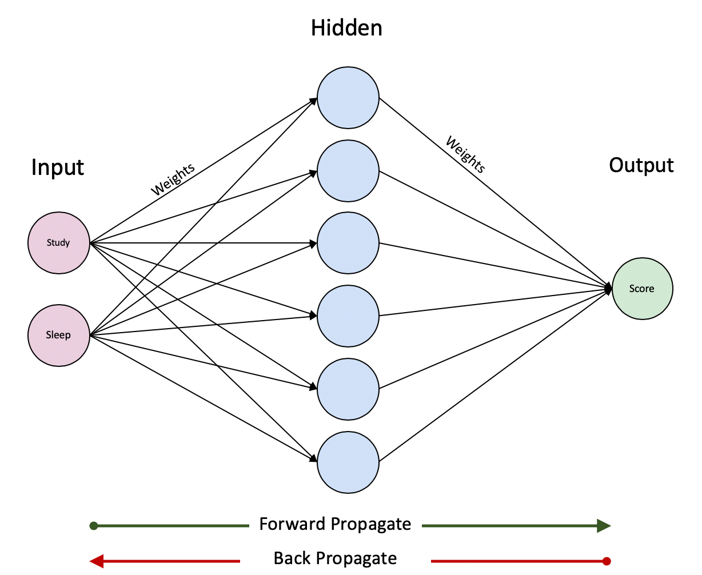

# Introduction

The idea of this notebook is to explore a step-by-step approach to create a <b>single layer neural network</b> without the help of any third party library. In practice, this neural network should be useful enough to generate a simple non-linear regression model, though it's final goal is to help us understand the inner workings of one.



## 1. Working Data

First we will create a <b>secret function</b> that will generate a test score based on students hours of sleep and study. Note that in real life scenarios not only these secret functions will be unknown but in practice they usually dont exist, meaning, underlying relations between variables such as a Sleep and Study is far more complex and cannot be defined by a simple continuous function.
    
Additionally, as we will later observe, we expect that our neural network should provide us good approximations or predictors of the score but the actual secret function will remain unknown. In other works, we will only have a different, complex continuous function in which its output should be enough to approximate the original one.

```R
# Our secret function
secretFunction <- function(x) {
  y <- (x[,1]^2 + x[,2]^2)
  return(t(t(y)))
}
```

Let's assume a sample of 9 students, where each one had 3 days (72 hours) prior to the test and they either slept or studied.

```
# Our train (X) and test (xTest) data
Study <- round(runif(9,1,24))
Sleep <- 72 - Study
X <- data.frame(Study=Study,Sleep=Sleep)
xTest = rbind(c(3,7),c(2,8))

# We generate our Y train (y)
y <- secretFunction(X)
```

```R
# This is our Study, Sleep and Score table
cbind(X,Score=y)
```


