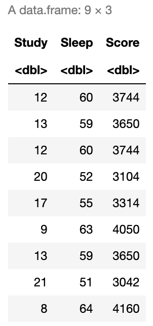

# Introduction

The idea of this notebook is to explore a step-by-step approach to create a <b>single layer neural network</b> without the help of any third party library. In practice, this neural network should be useful enough to generate a simple non-linear regression model, though it's final goal is to help us understand the inner workings of one.


## 1. Working Data

First we will create a <b>secret function</b> that will generate a test score based on students hours of sleep and study. Note that in real life scenarios not only these secret functions will be unknown but in practice they usually dont exist, meaning, underlying relations between variables such as a Sleep and Study is far more complex and cannot be defined by a simple continuous function.
    
Additionally, as we will later observe, we expect that our neural network should provide us good approximations or predictors of the score but the actual secret function will remain unknown. In other works, we will only have a different, complex continuous function in which its output should be enough to approximate the original one.

```R
# Our secret function
secretFunction <- function(x) {
  y <- (x[,1]^2 + x[,2]^2)
  return(t(t(y)))
}
```

Let's assume a sample of 9 students, where each one had 3 days (72 hours) prior to the test and they either slept or studied.

```R
# Our train (X) and test (xTest) data
Study <- round(runif(9,1,24))
Sleep <- 72 - Study
X <- data.frame(Study=Study,Sleep=Sleep)
xTest = rbind(c(3,7),c(2,8))

# We generate our Y train (y)
y <- secretFunction(X)
```

```R
# This is our Study, Sleep and Score table
cbind(X,Score=y)
```



## 2. Generating the model

### 2.1 Functions

<b>First, we need some functions to be defined:</b>
- <b>Rand</b>: Generate random numbers
- <b>Sigmoid</b>: Our non-linear activation function to be executed by our Sigmoid neuron.
- <b>Forward</b>: Our forward propagation function.
- <b>Sigmoid Prime</b>: Gradient of our Sigmoid function for Backward Propagation.
- <b>Cost</b>: Cost calculation funtion (sum of squared errors)

```R
# Random Function
rand <- function(x) { 
  return(runif(1, 5, 100)/100) 
}

# Sigmoid Function
sigmoid <- function(x) {
  return(1/(1+exp(1)^-x))
}

# Forward Propagation Function
Forward <- function(X,w1,w2) {
  X <- cbind(X[,1],X[,1])
  z2 <- X %*% w1
  a2 <- sigmoid(z2)
  z3 <- a2 %*% w2
  yHat <- sigmoid(z3)
  return(yHat)
}

# Sigmoid Gradient Function
sigmoidPrime <- function(x) {
  return((exp(1)^-x)/(1+(exp(1)^-x))^2)
}

# Cost Function
cost <- function(y,yHat) {
  sum(((yHat-y)^2)/2)
}
```

### 2.2 Parameter Initialization

Next, we need to define our parameters.
We have two sets of parameters:
- <b>Hyperparameters:</b> Parameters that the network cannot learn and are pre-defined.
    - <b>Number of hidden layers:</b> In this case we have 1, since it's a simple single layered neural network.
    - <b>Number of Neurons of hidden layers:</b> We will use 6.
    - <b>Learning Rate:</b> We will use 2.
- <b>Learning Parameters:</b> Parameters that our network will <b>learn</b>.
    - <b>Weights:</b> We will use 2 weights since by design we will need at leas N+1 weights where N is equivalent to the number of Hidden Layers.

```R
# Hyperparameters
inputLayerSize = ncol(X)
outputLayerSize = 1 # Dimension of outputs (1 since it's only score)
hiddenLayerSize = 6 # Number of neurons
LearningRate <- 2

# Weights
w1 <- matrix(runif(inputLayerSize*hiddenLayerSize), nrow = inputLayerSize, ncol = hiddenLayerSize )
w2 <- matrix(runif(hiddenLayerSize*outputLayerSize), nrow = hiddenLayerSize, ncol = outputLayerSize )
```

### 2.3 Data Normalization

```R
# We normalize train data
X = X/max(X)
y = y/max(y)

# We normnalize test data
xTest <- xTest/max(X)
yTest <- secretFunction(xTest)/max(y)
```


