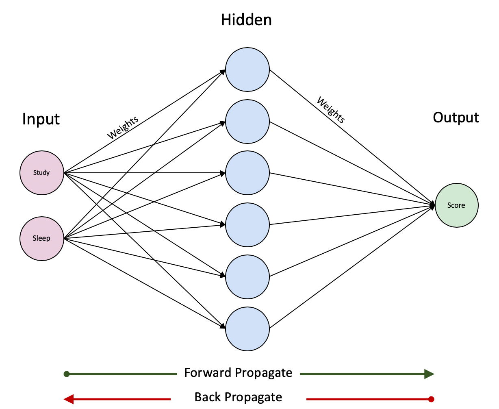

# One layer neural network made in R from scratch.

The idea of this notebook is to explore a step-by-step approach to create a <b>single layer neural network</b> without the help of any third party library. In practice, this neural network should be useful enough to generate a simple non-linear regression model, though it's final goal is to help us understand the inner workings of one.

